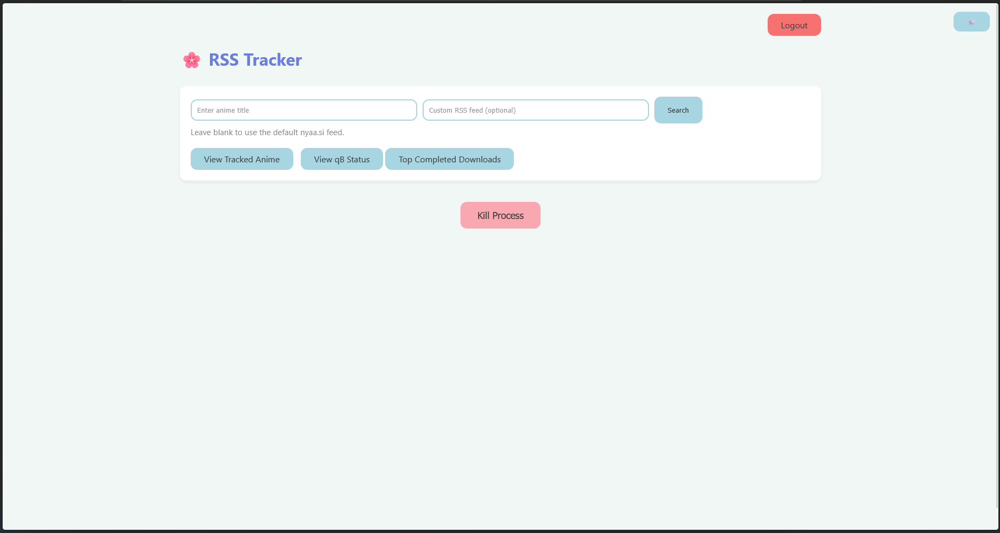
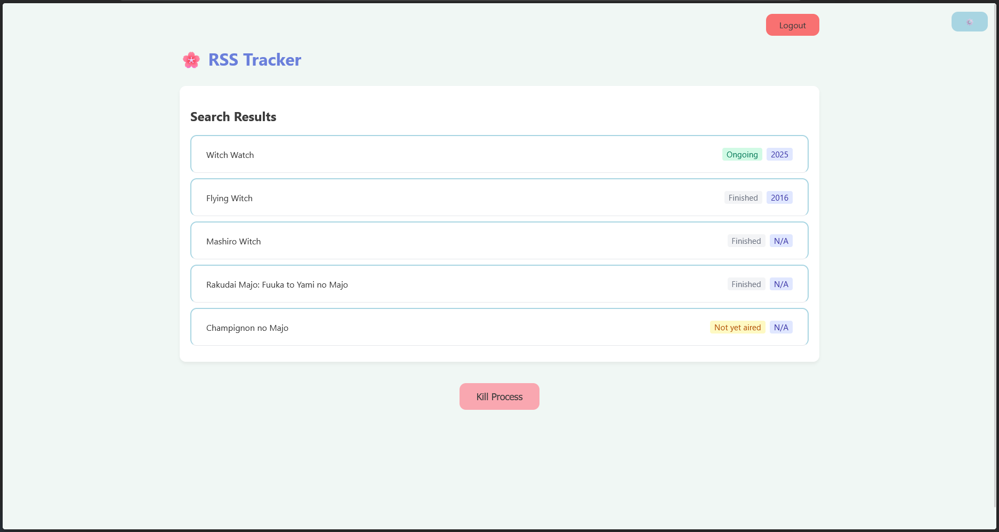
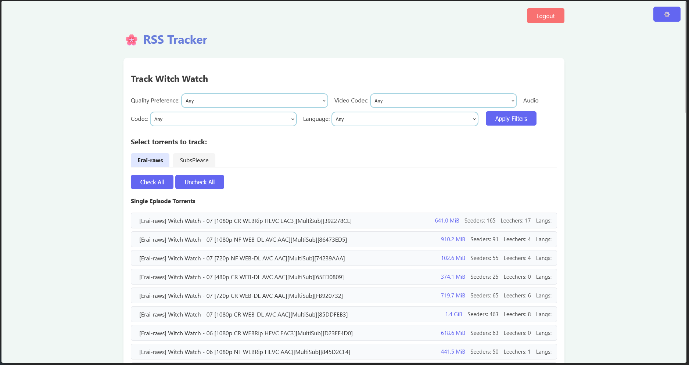

# NyaaSi RSS Downloader

A Flask web application for tracking and downloading anime torrents from [Nyaa.si](https://nyaa.si) using RSS feeds. It supports searching anime via the Jikan API, tracking series, filtering torrents, and managing downloads with qBittorrent.

## Features

- Search anime using the Jikan API (MyAnimeList).
- Track anime series and automatically download new episodes.
- Filter torrents by quality, codec, and language.
- Manage downloads via qBittorrent Web API.
- View top completed downloads from Nyaa.si.
- User authentication and session management.
- Customizable download paths.
- Web UI with status and tracking lists.

## Requirements

- Python 3.9+
- qBittorrent with Web UI enabled
- [Nyaa.si](https://nyaa.si) access
- (Optional) Docker

## Setup

1. **Clone the repository:**
   ```sh
   git clone <repo-url>
   cd NyaaSiRSSDownloader/app
   ```

2. **Install dependencies:**
   ```sh
   pip install -r requirements.txt
   ```

3. **Configure environment variables:**

   Create a `.env` file in the `app/` directory with the following:
   ```
   FLASK_SECRET_KEY=your_secret_key
   ADMIN_USERNAME=your_admin_username
   ADMIN_PASSWORD_HASH=base64_encoded_password
   QB_URL=http://localhost:8080
   QB_USERNAME=qbittorrent_username
   QB_PASSWORD=qbittorrent_password
   CHECK_INTERVAL=1800
   ```

   - `ADMIN_PASSWORD_HASH` should be your password encoded in base64.

4. **Run the application:**
   ```sh
   python main.py
   ```

   The app will be available at [http://localhost:5000](http://localhost:5000).

## Docker

To run with Docker:

```sh
docker build -t nyaasi-rss-downloader .
docker run -p 5000:5000 --env-file app/.env nyaasi-rss-downloader
```

## Usage

- Visit `/login` to sign in.
- Search for anime, select and track series.
- Manage tracked anime and view download status.
- Configure download paths and qBittorrent settings as needed.

## License

This project is licensed under the [GNU GPL v3](LICENSE).

---




